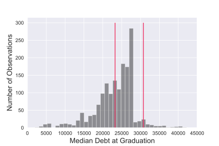
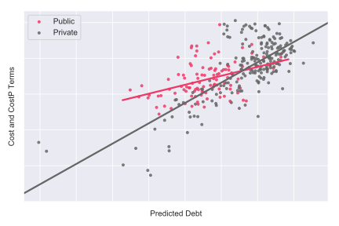

# student-loan-regression
A data science portfolio project

## Need for Study

Americans owe over 1.5 trillion dollars in student loan debt according to the [NY Federal Reserve.](https://www.newyorkfed.org/microeconomics/hhdc.html)

These loans can have a significant impact on life after graduation per [Pew Research.](http://www.pewresearch.org/fact-tank/2017/08/24/5-facts-about-student-loans/) 

- About one-in-five employed adults ages 25 to 39 with at least a bachelor’s degree and outstanding student loans (21%) have more than one job. Those without student loan debt are roughly half as likely (11%) to hold multiple jobs.

- Only 27% of young college graduates with student loans say they are living comfortably, compared with 45% of college graduates of a similar age without outstanding loans.

You're a high school guidance counselor. What do you tell your students?

## Study parameters 

### Population

Four year, US-based, public and private universities.
### Target

Median student debt at graduation, for students receiving Federal Direct Student Loans, per school.

### Features

* College type (public, private non-profit)
* Number of undergraduates
* Admissions
	* Selective or noncompetitive admissions policy
	* Freshman SAT score
* Makeup of students
	* Ethnicity
	* Low income (Pell-eligible students)
	* Percent of "traditional freshmen" (full-time, first-time, degree-seeking undergraduates versus transfers and other nontraditional students entering in the fall cohort)
* Cost of attendance
* College operating expenses 
	- Average faculty salary
	- Percent part time faculty
	- Cost of instruction per full-time student

#### Assignment requirements
To complete this assignment, at least 10 features and 1000 rows are required. At least some portion of the data must be scraped from the web using a tool like Selenium or requests. The data should be analyzed using linear regresssion with cross validation training and 
testing using holdout data.

## Results

The features were only weak predictors of the target variable. My R-squared metric obtained from the holdout data  was 0.324. 

The largest coefficient in the model was the  intercept value of 23,000 dollars. In other words, the model starts with no feature information
with an inital guess that students would be borrowing close to the maximum amount the federal government will 
loan for four years of education.

This reflects the distribution of the target feature set. Most schools in the data set report a median debt at 
graduation at the direct studnet loan maximum amount for 3.5 to 4.5 years of study (as marked with pink bars below). 

The strongest postiive coefficient was cost: Students who attend more expensive colleges tend to borrow more money. I tried 
several interaction effects where I multiplied predictors by a one-hot vector indicating public versus private institutions.
Cost was also the only feature where that interaction variable had an effect. The slope of the private college line is 
steeper than that for public colleges. However, once I made the plot, it looked like I was chasing outliers: Specifically private
universities with unusal tuition structures. The effect may disappear if I do further cleaning of outliers. 

The strongest negative coeffients were associated with college budgets: The average faculty salary and the instructional expenses
per full-time equivalent. These features  are indicators of the wealth of the school. Wealthy schools may offer better financial
aid with fewer loans. Howevr, it may also be that students from wealthier families (who would borrow less money in general)
are attracted to the schools that spend the most on their offerings.  

## Limits of study
1.	The average debt at graduation is a lagging indicator. The students who graduated in the 2016-17 school year (the most recent
data available) typically entered school four years earlier in 2012-2013 school year. College tuition and financial aid policies are always changing. There is some reason to believe that the rate of growth in student loans has tapered off in the past couple of years, for example [here.](https://ticas.org/sites/default/files/pub_files/classof2017.pdf)
3.	Average debt at graduation does not apply to students who do not graduate. The students who take out loans and do not gradate have the worst of both worlds: They have the debt of a college student without the increase in salary that comes along with a college degree. The College Scorecard dataset (above) tracks student debt when the student separates from a college, whether that is by graduation, transfer, or dropping out. However, average debt at 'separation' (which includes graduation, transfers, and dropping out) would include students who studied for different number of years.
4.	Debt can be a property of the student, rather than the school. Students from high income families are less likely to borrow than students from low income families no matter which college they choose. 
5.	The student loan crisis includes debt incurred at for-profit schools and in graduate school which are not included in the 
study.

